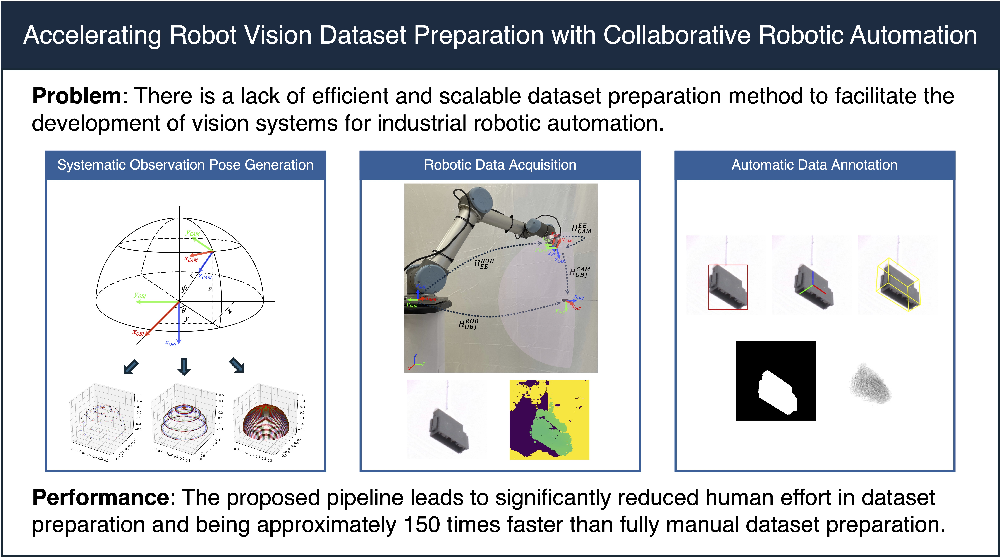

# Accelerating industrial vision: Systematic robot-assisted dataset preparation for object detection and pose estimation

This is the official implementation of our paper published in Engineering Applications of Artificial Intelligence.

> Accelerating industrial vision: Systematic robot-assisted dataset preparation for object detection and pose estimation  
> [Hao Wang](https://hwang7308.github.io/), [Gonzalo Urbanos Uriel](https://www.linkedin.com/in/gonzalo-urbanos-9707b7158/), [Karim El-Nahass](https://www.linkedin.com/in/karim-el-nahass/), [Sven Ekered](https://www.chalmers.se/en/persons/svee/), [Björn Johansson](https://www.chalmers.se/en/persons/job/)



### [Paper](https://doi.org/10.1016/j.engappai.2026.114741)

The creation of large-scale, high-quality training datasets continues to present a significant challenge for the implementation of artificial intelligence in engineering and industrial robotics. This study introduces a collaborative robot-assisted pipeline that automates data acquisition and annotation, thereby accelerating dataset preparation for object detection and six-degree-of-freedom pose estimation. The proposed system integrates robotic kinematics and image processing to generate vision datasets with multimodal ground-truth labels, such as two-dimensional and three-dimensional bounding boxes, segmentation masks, six-degree-of-freedom poses, and point clouds, within a unified artificial intelligence-driven workflow. To demonstrate the pipeline’s capacity to reduce manual effort and efficiently generate large-scale training datasets for industrial vision applications, an automotive wire harness connector dataset was experimentally prepared using the proposed pipeline. This method achieved annotation speeds approximately 150 times faster than traditional manual techniques and produced high-quality training data for deep learning models. Evaluation with deep learning-based object detection and pose estimation algorithms confirms the effectiveness of the proposed pipeline in preparing datasets for the development of industrial intelligent vision systems. By minimizing human intervention and ensuring systematic viewpoint coverage during dataset preparation, the proposed approach facilitates scalable adoption of artificial intelligence-powered vision systems in industrial automation.

## Citation
If you find this code useful for your research, please use the following BibTeX entry.

```bibtex
@article{wang2026accelerating,
	title = {Accelerating industrial vision: Systematic robot-assisted dataset preparation for object detection and pose estimation},
	author = {Hao Wang and Gonzalo {Urbanos Uriel} and Karim El-Nahass and Sven Ekered and Björn Johansson},
	year = 2026,
	journal = {Engineering Applications of Artificial Intelligence},
	volume = 176,
	pages = 114741,
	doi = {10.1016/j.engappai.2026.114741}
}
```

## How to

Before running the program, you need to specify the following parameters.

1. The ip address of your robot to guarantee a successful connection to your robot.
2. The numbers of the step the robot should move regarding the polar angle and the azimuthal angle.

<summary>Image collection</summary>

```bash
python data_acquisition.py
```
<summary>Image annotation</summary>

```bash
python data_annotation.py
```

## Acknowledgment

This work was supported by the [EWASS](https://www.vinnova.se/en/p/ewass---empowering-human-workers-for-assembly-of-wire-harnesses/) project, funded by the Swedish innovation agency, Vinnova, and the strategic innovation program, Produktion2030, with grant number 2022-01279. This work was also supported by the [MAXBATT](https://www.chalmers.se/en/centres/maxbatt/) project, funded by Region Västra Götaland, with grant number MRU2024-00381. The work was carried out within [Chalmers Production Area of Advance](https://www.chalmers.se/en/collaborate-with-us/collaborate-in-research/research-related-contacts/production-area-of-advance/). [Wiretronic AB](https://wiretronic.com/en/) and [Volvo Car Corporation](https://www.volvocars.com/) provided the automotive wire harness connectors used in this work. The support is gratefully acknowledged.

This project uses the [UR - RTDE](https://www.universal-robots.com/how-tos-and-faqs/how-to/ur-how-tos/real-time-data-exchange-rtde-guide-22229/) protocol to send continuous updates to the UR robot for smooth continued motion, and heavily relies on this repository: https://github.com/Mandelbr0t/UniversalRobot-RealtimeControl, which builds ontop of: https://bitbucket.org/RopeRobotics/ur-interface/src/master/.

The visualization of annotation labels is adapted from [FoundationPose](https://github.com/NVlabs/FoundationPose).

## Contact
For questions, please contact [Hao Wang](https://hwang7308.github.io/).
